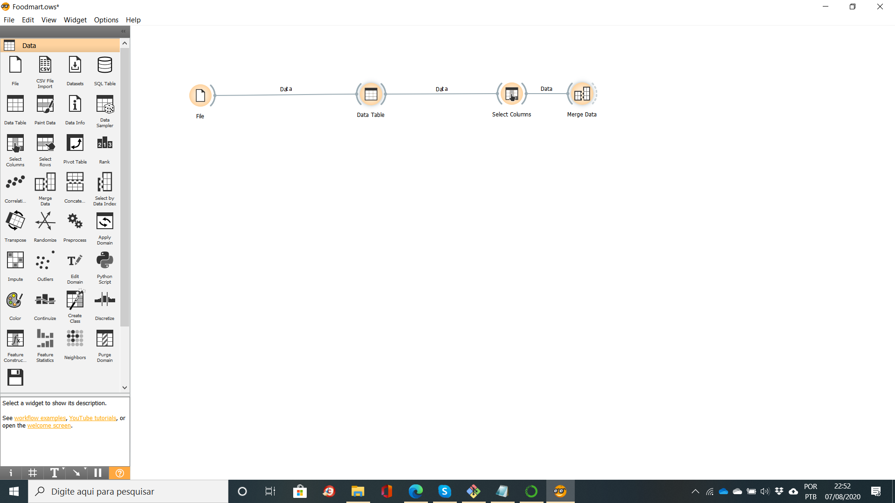
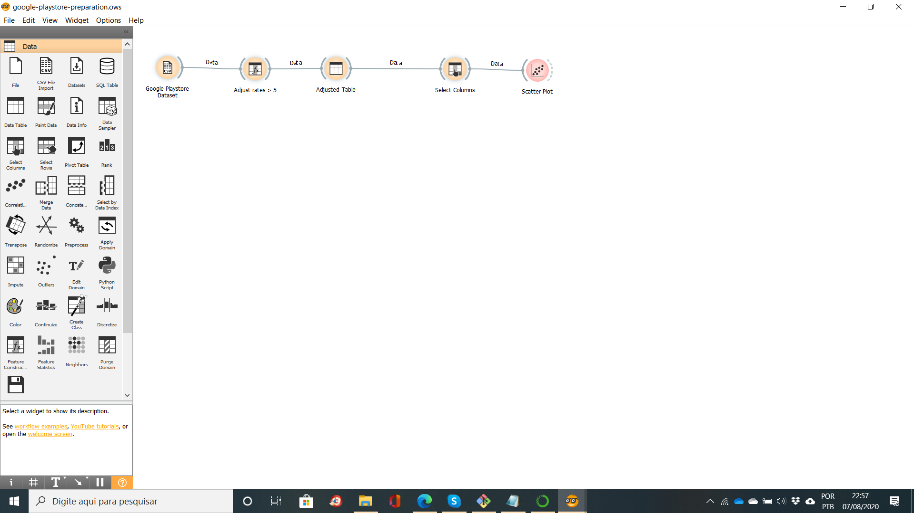
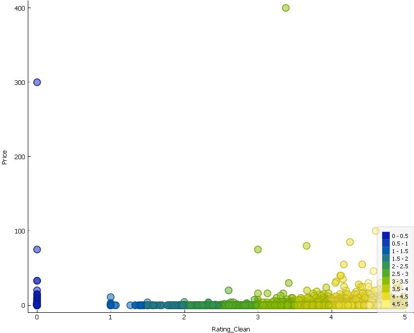
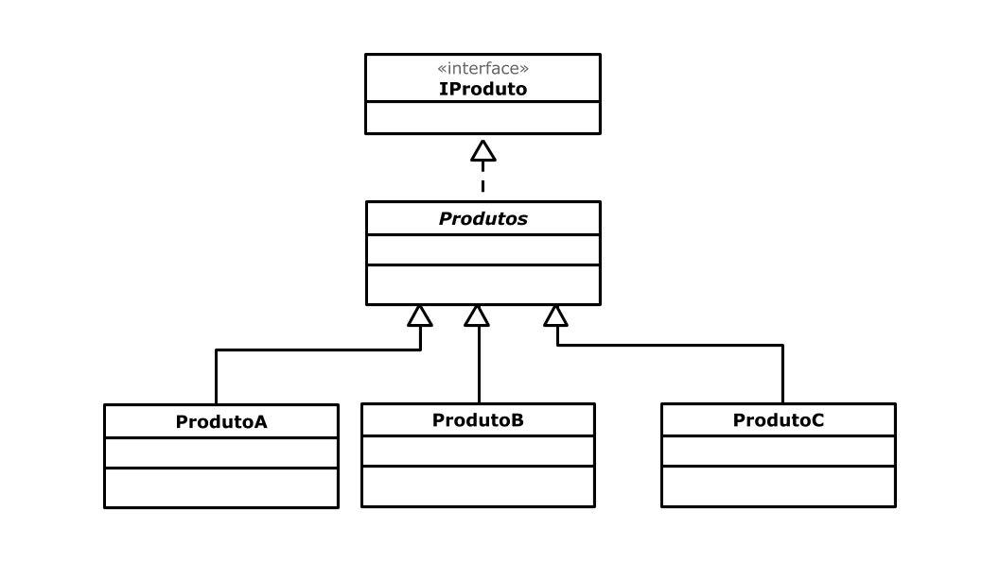
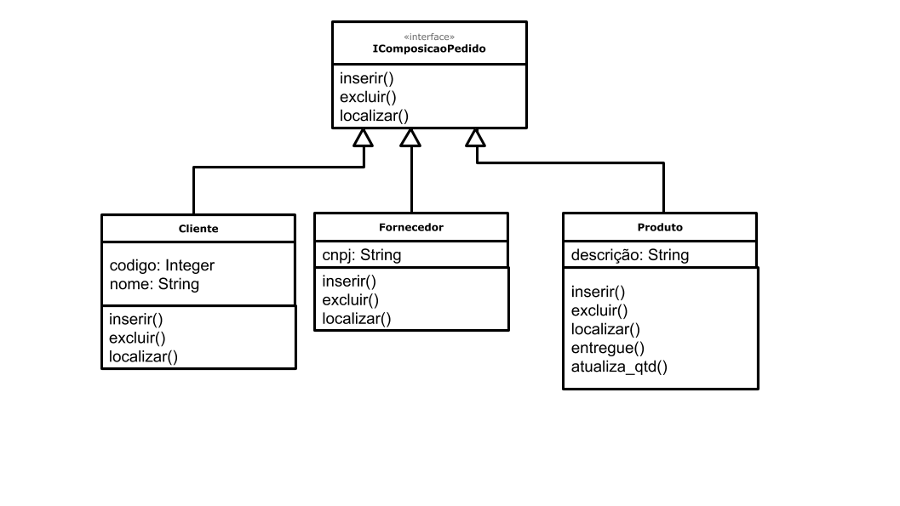

# Atividades desenvolvidas para Laboratorio 1

# Lab01 - Data Flow, Componentes e Regras de Associação

# Projeto Orange / Regras de Associação para Foodmart

# Tarefa Foodmart

## Imagem do Projeto

## Arquivo do Projeto
[Arquivo](orange/Foodmart.ows)

# Projeto Orange / Análise de Dados do Google PlayStore

## Imagem do Projeto

## Arquivo do Projeto
[Arquivo](orange/google-playstore-preparation.ows)

## Gráfico(s) de Análise

# Projeto de Composição de Componentes para Recomendação

# Projeto de Composição de Componentes para Pedido

## Diagrama de Componentes

