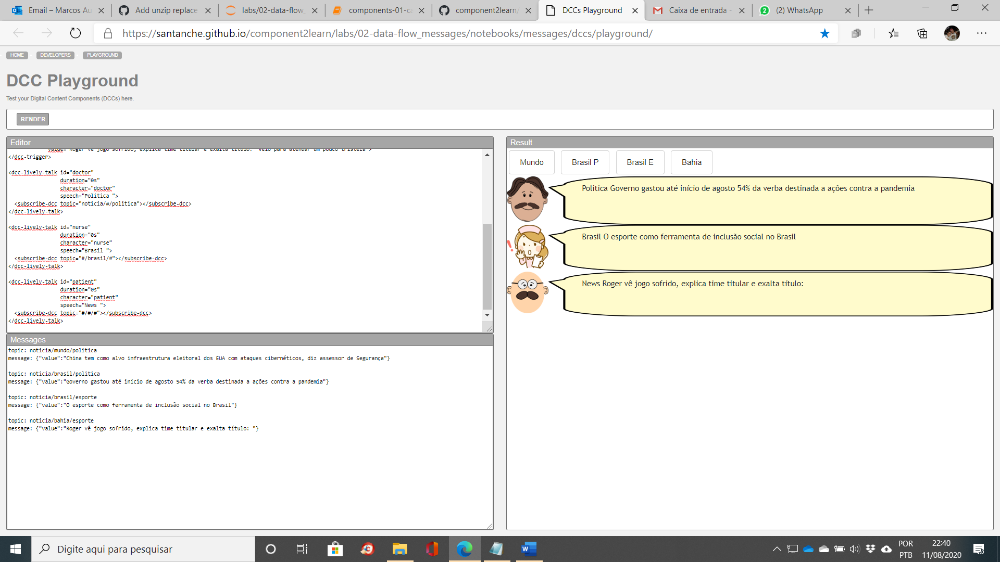
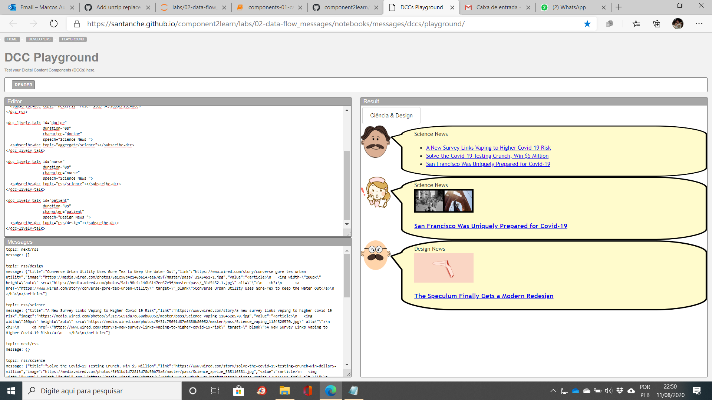

# Atividades desenvolvidas para Laboratorio 2

# Data Flow e Componentes (parte 2)
### Lab de Componentização e Reúso de Software 08/08/2020

## Arquivo do Projeto
[Arquivo](jupyterNotebook/components-01-catalog.ipynb)

# Componentes e Mensagens

## Tarefa Web Components 1

## Arquivo do Projeto
[Arquivo](dCCPlayground/dCCPlayground1.txt)

## Imagem do Projeto

## Tarefa Web Components 2

## Arquivo do Projeto
[Arquivo](dCCPlayground/dCCPlayground2.txt)

## Imagem do Projeto

