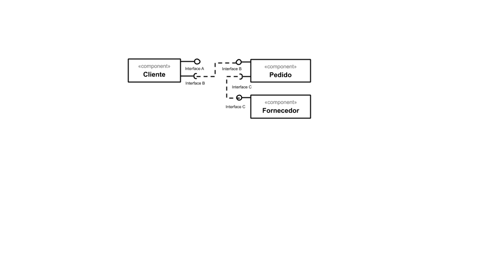
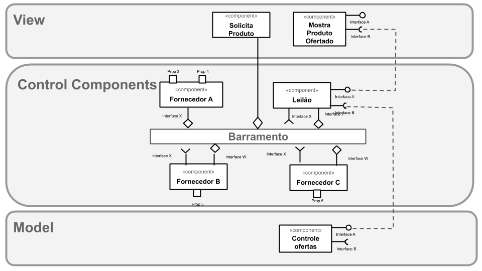
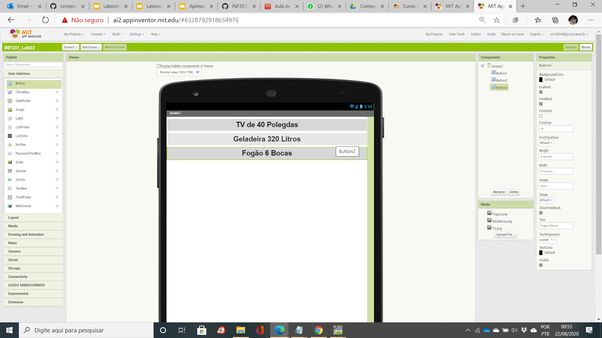
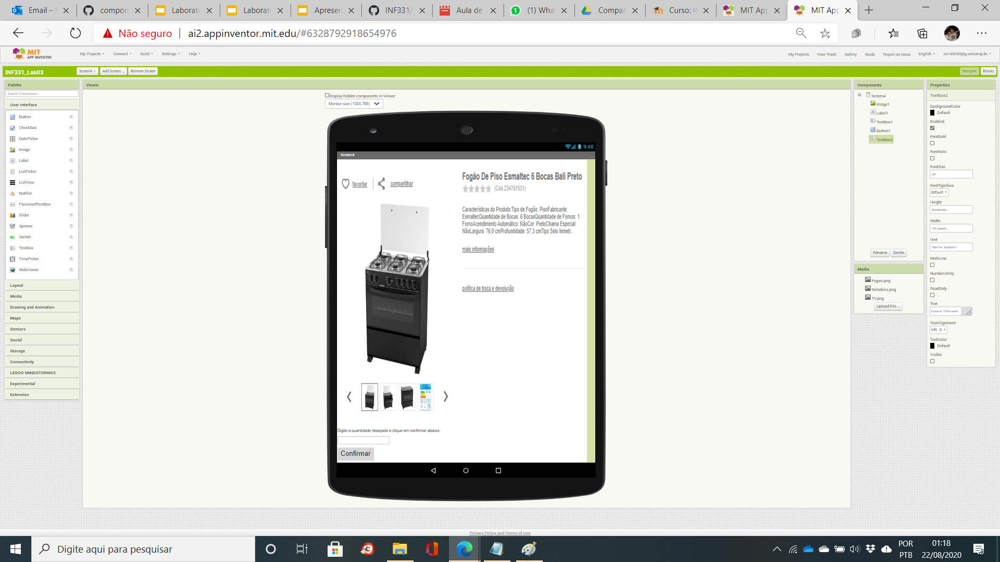
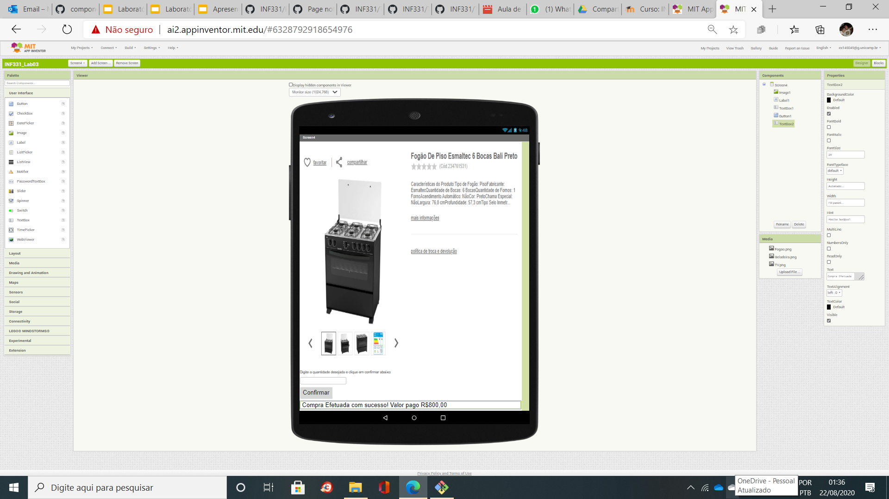
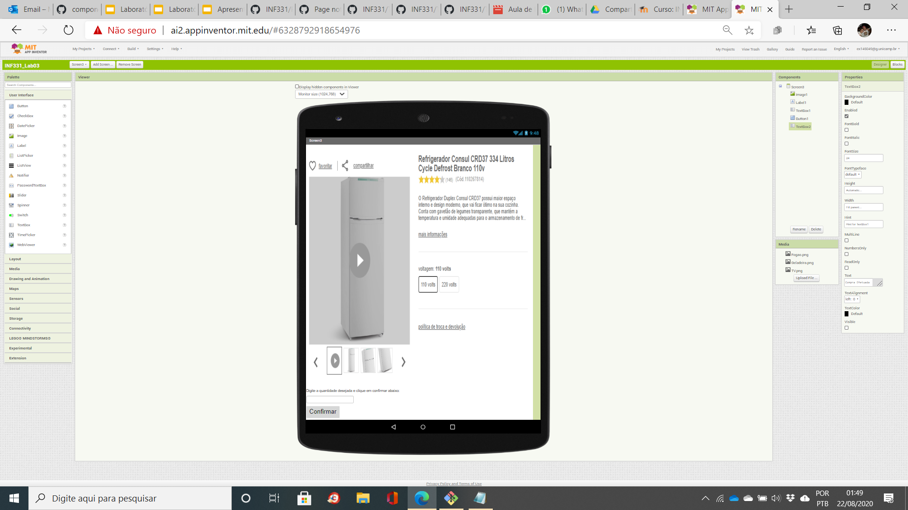
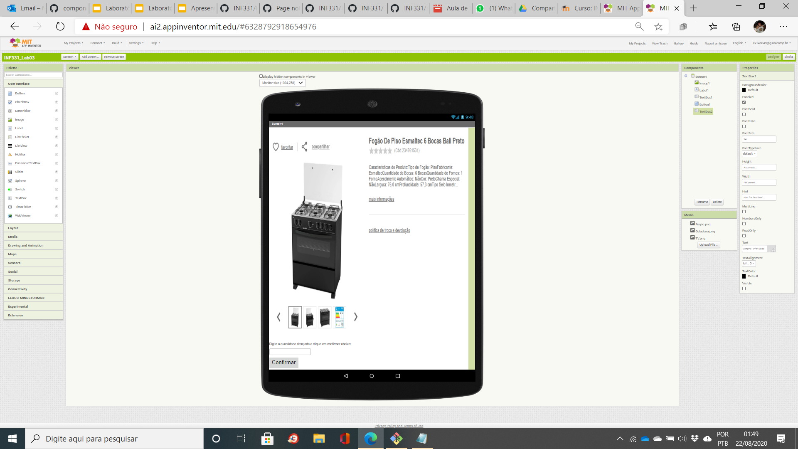

# Orquestração e Coreografia
*Lab de Componentização e Reúso de Software 15/08/2020*

No link do Google Drive [modelo](https://docs.google.com/presentation/d/1UMC749wjVD1aRUSH1OuiT006SkXqYUjedhL8fZJd6xY/edit?usp=sharing) ou no diretório [resources/](resources/) você encontrará um modelo para resolver duas tarefas:

## Tarefa 1

## Imagem do Projeto

## Tarefa 2

* O cliente seleciona um produto;
* Um módulo de leilão informa a todos os potenciais fornecedores daquele produto sobre a demanda e inicia um leilão;
* Os potenciais fornecedores fazem ofertas;
* Os três produtos com menor preço são apresentados para o cliente - em caso de empate de preço, considerar quem fez primeiro a oferta.

## Imagem do Projeto

## Tarefa 3

  * uma lista opções com o nome de três produtos (a sua escolha)

  * um quadro de detalhes do produto;
  * um campo para o usuário digitar a quantidade que deseja comprar;
  * um botão de efetivação da compra:

  * um campo de mensagens no rodapé com  detalhamento:

## Tarefa 4

## Link do Projeto

https://github.com/inf331Equipe05/equipe5.git