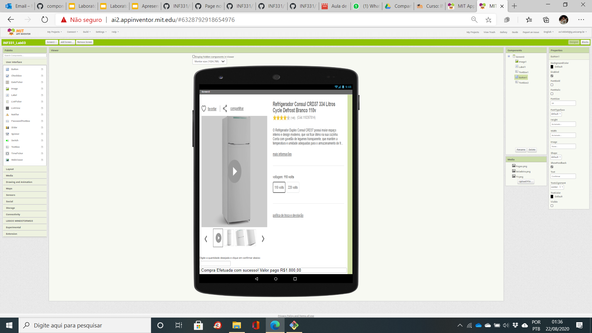

# Orquestração e Coreografia
*Lab de Componentização e Reúso de Software 15/08/2020*

Professor André, eu só tenho Iphone, então não consegui simular!

## Tarefa 1

## Imagem do Projeto

## Tarefa 2

* O cliente seleciona um produto;
* Um módulo de leilão informa a todos os potenciais fornecedores daquele produto sobre a demanda e inicia um leilão;
* Os potenciais fornecedores fazem ofertas;
* Os três produtos com menor preço são apresentados para o cliente - em caso de empate de preço, considerar quem fez primeiro a oferta.

## Imagem do Projeto

## Tarefa 3

  * uma lista opções com o nome de três produtos (a sua escolha)

  * Quadro de detalhes do produto, campo para o usuário digitar a quantidade que deseja comprar e botão de efetivação da compra:

  * Campo de mensagens no rodapé com  detalhamento:

 * Blocos telas 1 a 4:

## Tarefa 4

## Link do Projeto

https://github.com/inf331Equipe05/equipe5.git