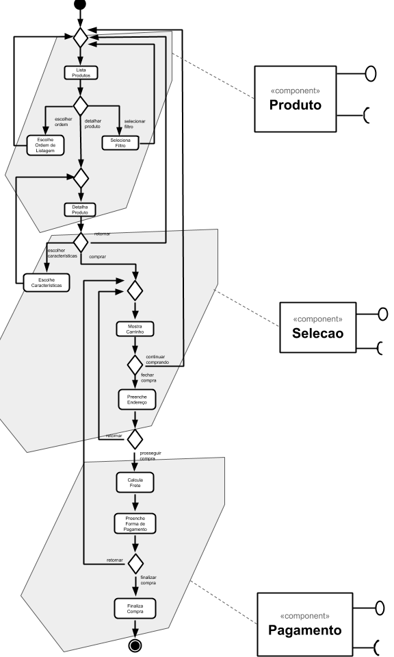
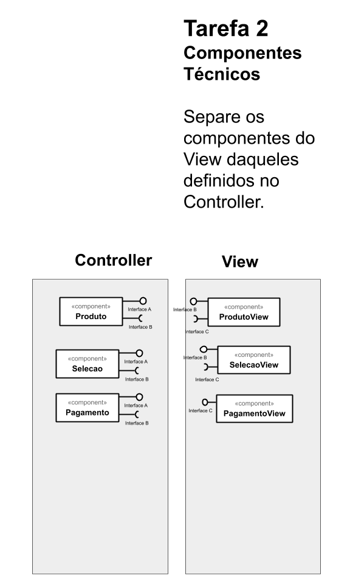
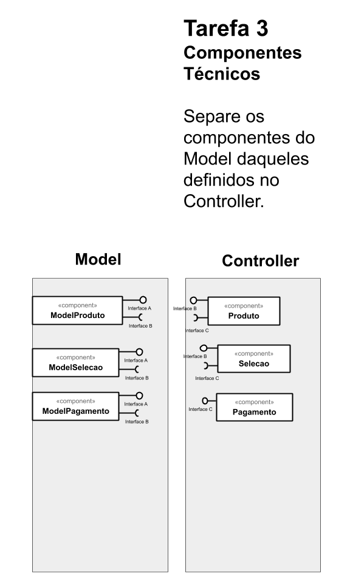

# Serviços
*Lab de Componentização e Reúso de Software 22/08/2020*

## Tarefa 1
*Componentes de Negócio*

## Imagem do Projeto

## Tarefa 2
*Componentes Técnicos*

## Imagem do Projeto

## Tarefa 3
*Componentes Técnicos*

## Imagem do Projeto

## Tarefa 4

Encontre dois serviços REST interessantes, que recebam no mínimo dois parâmetros e execute pelo menos uma consulta em cada um deles. Apresente para cada serviço que você escolheu:

* o título do serviço: smmart-me
* a URI do serviço: https://smart-me.com:443/api/Devices
* uma breve descrição do mesmo: O smart-me oferece interfaces para sistemas de terceiros, bem como integrações em softwares existentes da empresa. Desta forma, permitimos que você reúna soluções sob medida para seus clientes e máxima flexibilidade para você
* o cabeçalho HTTP da requisição: 

~~~http
:authority: any-api.com:8443
:method: OPTIONS
:path: /https://smart-me.com:443/api/Devices
:scheme: https
accept: */*
accept-encoding: gzip, deflate, br
accept-language: pt-BR,pt;q=0.9,en;q=0.8,en-GB;q=0.7,en-US;q=0.6
access-control-request-headers: authorization
access-control-request-method: GET
origin: https://any-api.com
referer: https://any-api.com/smart_me_com/smart_me_com/console/_api_Devices/GET
sec-fetch-dest: empty
sec-fetch-mode: cors
sec-fetch-site: same-site
user-agent: Mozilla/5.0 (Windows NT 10.0; Win64; x64) AppleWebKit/537.36 (KHTML, like Gecko) Chrome/84.0.4147.135 Safari/537.36 Edg/84.0.522.63
~~~
* o cabeçalho e conteúdo JSON, XML ou outro formato da resposta:
~~~http
access-control-allow-headers: authorization
access-control-allow-methods: GET
access-control-allow-origin: *
access-control-expose-headers: access-control-allow-origin,access-control-allow-methods,access-control-allow-headers
cf-cache-status: DYNAMIC
cf-ray: 5ca2d9fbcd91f73c-GRU
cf-request-id: 04d9a6915c0000f73c6caaf200000001
date: Sat, 29 Aug 2020 02:30:41 GMT
expect-ct: max-age=604800, report-uri="https://report-uri.cloudflare.com/cdn-cgi/beacon/expect-ct"
server: cloudflare
set-cookie: __cfduid=d9783db0173f071cfcc1b0523b02a4c8b1598668241; expires=Mon, 28-Sep-20 02:30:41 GMT; path=/; domain=.any-api.com; HttpOnly; SameSite=Lax
~~~