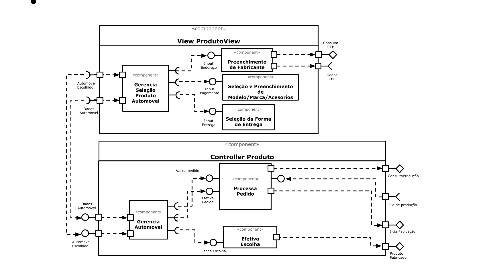

# Web como Plataforma e Subcomponentes
*Lab de Componentização e Reúso de Software 29/08/2020*

## Tarefa 1

## Componentes com sub-comopnentes

## Imagem do Projeto

## Tarefa 2

## Conta no Codepen:

* A URL do Codepen: https://codepen.io/marcos-fabr-cio/pen/eYZEOMp

* O Código HTML: 

* O Código Java com pequena alteração:

~~~http

class Barra extends React.Component {
  render() {
    let resultado = "";
    for (let b = 1; b <= this.props.tamanho; b++)
      resultado += "=";
    return resultado;
  }
}

const elemento = 

                   <h2>O dinossauro</h2>
                   <Barra tamanho="20"/>
                   <h2>pulou na lama</h2>
                   <Barra tamanho="20"/>
                   <h2>e ficou feliz!!!</h2>
                 
     
    ReactDOM.render(elemento, 
        document.getElementById("root"));

~~~